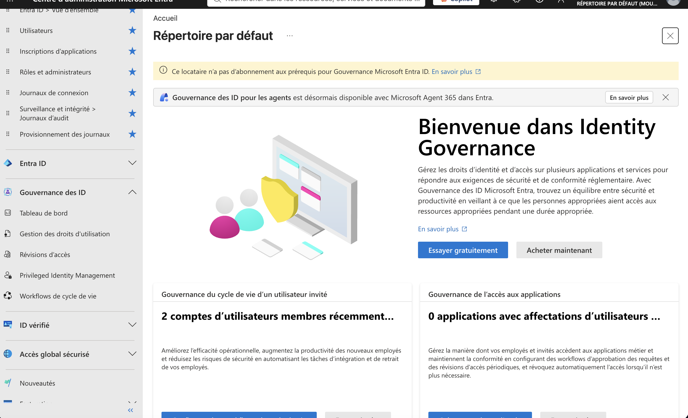

# SC-300 : Microsoft Identity and Access Administrator

Notes de préparation et labs documentés sur Microsoft Entra, rédigés en français pendant ma préparation à la certification SC-300.

Ce dépôt poursuit deux objectifs. Servir de support de révision structuré à qui prépare l'examen, en couvrant les quatre domaines officiels avec le niveau de détail produit qui y est réellement testé. Et documenter mon travail sur Microsoft Entra, en montrant ce que j'ai manipulé et ce que j'en ai conclu, pas seulement ce que j'ai lu.

Les notes sont écrites pour être discutées : chaque affirmation vise à être vérifiable dans la documentation Microsoft, et les points où le produit se comporte autrement qu'attendu sont signalés comme tels.

## Cadrage

Le contenu suit les compétences mesurées du study guide officiel, dans leur version **en vigueur depuis le 27 avril 2026** ([Microsoft Learn](https://learn.microsoft.com/fr-fr/credentials/certifications/resources/study-guides/sc-300)).

| Domaine officiel | Poids | Fiche |
|---|---:|---|
| Implement and manage user identities | 20 à 25 % | [Identités utilisateurs](fiches/01-identites-utilisateurs.md) |
| Implement authentication and access management | 25 à 30 % | [Authentification et accès](fiches/02-authentification-acces.md) |
| Plan and implement workload identities | 20 à 25 % | [Identités de workload](fiches/03-identites-workload.md) |
| Plan and automate identity governance | 20 à 25 % | [Gouvernance des identités](fiches/04-gouvernance-identites.md) |

La supervision et le diagnostic ne forment pas un domaine autonome dans le study guide : ils sont répartis dans les quatre domaines. Ils sont regroupés ici dans une [fiche transversale](fiches/05-supervision-diagnostic.md) parce que le choix du bon journal est une compétence à part entière.

## Contenu

### Fiches par domaine

- [01. Identités utilisateurs](fiches/01-identites-utilisateurs.md) : tenant, rôles Entra et Azure RBAC, administrative units, utilisateurs, groupes, licences, identités externes, identité hybride
- [02. Authentification et gestion des accès](fiches/02-authentification-acces.md) : méthodes d'authentification, TAP, authentication strength, Conditional Access, CAE, authentication context, ID Protection, Defender for Cloud Apps, Global Secure Access
- [03. Identités de workload](fiches/03-identites-workload.md) : application object et service principal, permissions et consentement, client credentials, managed identities, workload identity federation, app roles, proxy d'application
- [04. Gouvernance des identités](fiches/04-gouvernance-identites.md) : Entitlement Management, access reviews, PIM, Lifecycle Workflows, comptes d'urgence
- [05. Supervision et diagnostic](fiches/05-supervision-diagnostic.md) : les trois journaux, lecture d'un événement, export et KQL, outils de diagnostic

### Fiches transversales

- [06. Glossaire](fiches/06-glossaire.md) : les termes du domaine, regroupés par thème
- [07. Différences clés](fiches/07-differences-cles.md) : les couples de notions que l'examen confond, avec le critère qui tranche
- [08. Quand utiliser quoi](fiches/08-quand-utiliser-quoi.md) : table de décision besoin vers fonctionnalité, avec la licence minimale
- [09. Pièges d'examen](fiches/09-pieges-examen.md) : les endroits où une réponse plausible est fausse
- [10. Parallèle avec un IAM open source](fiches/10-parallele-keycloak.md) : ce qui se transpose depuis Keycloak et OIDC, et ce qui ne se transpose pas
- [11. Synthèse finale](fiches/11-synthese-finale.md) : relecture de dernière minute
- [12. Compléments study guide 2026](fiches/12-complements-study-guide-2026.md) : objectifs explicites encore peu développés ailleurs, notamment domaines personnalisés, branding, CBA/X509SKI, Windows Hello for Business, SAML/SCIM, Defender for Cloud Apps et Terms of Use

### Labs

Le dossier [labs](labs/) documente cinq manipulations réalisées sur un tenant de test : ce qu'elles cherchaient à établir, les rôles et licences nécessaires, ce qui a été observé, et ce qu'on peut en conclure. Elles couvrent la séparation identité et autorisation, le modèle d'application, le flux app-only et la lecture d'un token, les trois journaux, et un scénario de retrait d'accès.

## Périmètre et limites

Le dépôt vise désormais à couvrir les objectifs explicites du study guide SC-300 du 27 avril 2026. La profondeur pratique n'est toutefois pas uniforme : les fonctionnalités indisponibles dans le tenant de test restent documentées sur le plan théorique.

Les labs ont été réalisés sur un tenant en **édition Free avec Security Defaults**. Tout ce qui exige P1, P2, Microsoft Entra ID Governance ou Workload ID Premium n'a donc pas pu être manipulé dans les mêmes conditions : Conditional Access, PIM, access reviews, certaines capacités avancées d'Entitlement Management, Lifecycle Workflows, ID Protection, groupes dynamiques et administrative units à membres dynamiques.

Les sujets qui restent surtout théoriques dans ce dépôt sont notamment le provisioning applicatif SCIM en profondeur, la configuration complète d'un SSO SAML et de son mapping de claims, Windows Hello for Business en environnement hybride, les scénarios avancés de Defender for Cloud Apps, les domaines personnalisés et Company Branding. La fiche [12](fiches/12-complements-study-guide-2026.md) couvre les points d'examen associés pour éviter un trou dans la révision.

Microsoft Entra Verified ID et Permissions Management restent des sujets IAM intéressants, mais ils ne sont pas listés comme objectifs explicites dans le study guide SC-300 en vigueur depuis le 27 avril 2026. Ils ne sont donc pas utilisés ici pour mesurer la complétude de la couverture d'examen.

Le contenu reflète l'état du produit à la date de la dernière mise à jour. Microsoft Entra évolue vite, et certains écrans, licences ou noms de fonctionnalités peuvent changer. La documentation officielle fait foi.

## Avertissement

Ces notes sont un travail personnel de synthèse. Elles ne reproduisent ni ne paraphrasent aucune question d'examen, aucun élément du contenu sous licence Microsoft, ni aucun matériel couvert par le Microsoft Certification Program Agreement. Elles s'appuient sur la documentation publique Microsoft Learn, sur la documentation produit de Microsoft Entra, et sur des manipulations effectuées dans un tenant de test personnel.

Ce dépôt n'est ni affilié à Microsoft, ni approuvé par Microsoft. Microsoft, Microsoft Entra, Azure et SC-300 sont des marques de Microsoft Corporation. Keycloak est une marque de Red Hat. Elles sont citées ici à des fins d'identification, dans un contexte documentaire.

Les captures d'écran publiées dans [screenshots](screenshots/) ont toutes été relues une par une avant publication. Les valeurs sensibles y sont couvertes par des aplats opaques : Tenant ID, Object ID, noms d'utilisateur principaux, adresse IP, identifiants de corrélation, valeur du client secret et identifiant du Temporary Access Pass. Les comptes visibles sont des comptes de test créés pour l'occasion. Les captures sources non masquées ne sont pas versionnées.

## Licence

Contenu publié sous [Creative Commons Attribution 4.0 International](LICENSE). Réutilisation, adaptation et traduction sont autorisées, y compris à usage commercial, sous réserve de citer la source.

## Auteur

Hadi Mouter, [GitHub](https://github.com/hadimouter)

Corrections et signalements d'imprécision sont les bienvenus par issue. Une erreur documentée avec sa source vaut mieux qu'une note qui reste fausse.
