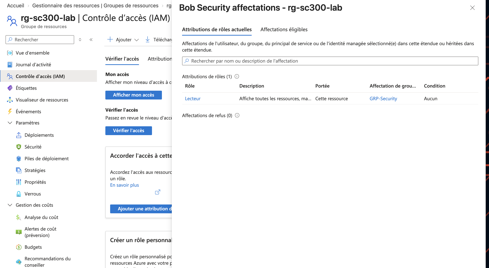
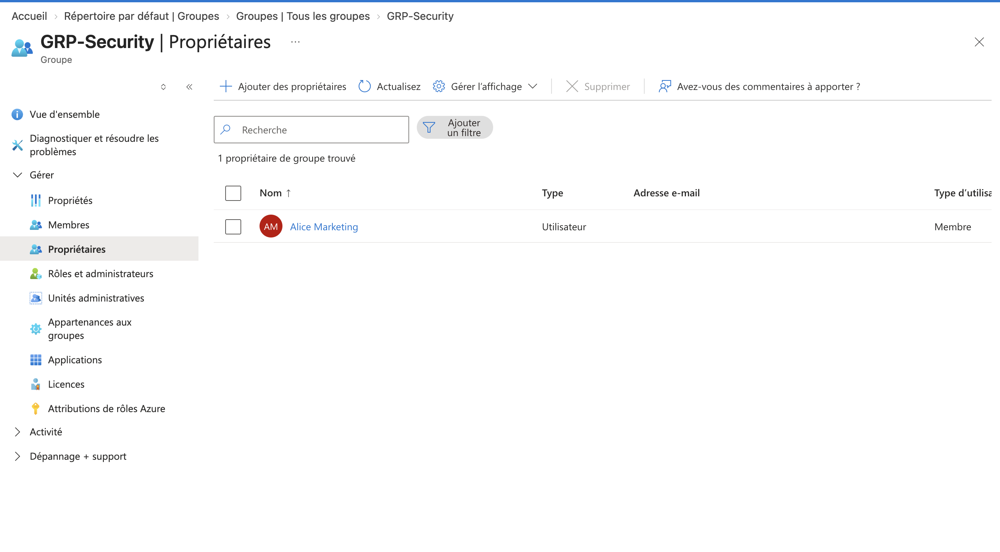
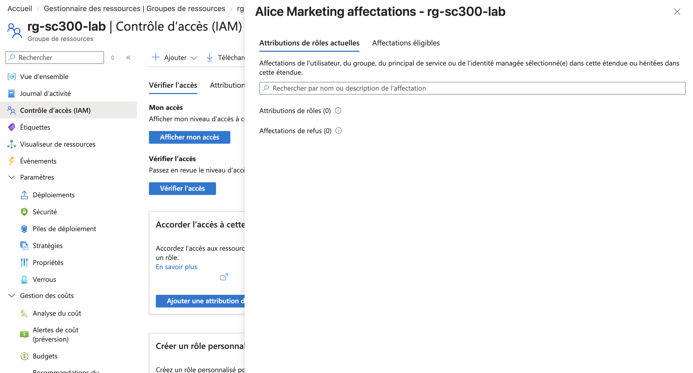

# Lab 1. Tenant, utilisateurs, groupes et Azure RBAC

## Ce que le lab établit

Que les rôles Microsoft Entra et Azure RBAC sont deux systèmes séparés, qu'un groupe de sécurité est le vecteur normal d'une autorisation Azure, et qu'être propriétaire d'un groupe ne donne rien de ce que ce groupe distribue.

## Prérequis

| Élément | Valeur |
|---|---|
| Rôle Entra | User Administrator pour créer les comptes et le groupe |
| Rôle Azure | Owner ou User Access Administrator sur l'abonnement, pour créer une affectation de rôle |
| Licence | Aucune. Un groupe à appartenance assignée fonctionne en édition Free |

## Manipulations

Création de deux utilisateurs cloud-only dans le tenant, l'un destiné à être membre du groupe, l'autre à en être propriétaire sans en être membre.

Création d'un groupe de sécurité à appartenance **assignée**. L'appartenance dynamique n'était pas disponible, faute de licence P1, ce qui est cohérent avec l'objectif : la démonstration porte sur le vecteur d'autorisation, pas sur le peuplement du groupe.

Ajout du premier utilisateur comme **Member**, du second comme **Owner** uniquement.

Création d'un resource group Azure, puis affectation du rôle **Reader** au groupe de sécurité, à la portée de ce resource group.

Vérification de l'accès effectif des deux comptes via Access control (IAM) puis Check access, puis connexion réelle avec chacun.

## Observations

Le membre voit le resource group et son contenu en lecture. L'affectation apparaît dans Check access avec la mention qu'elle est héritée du groupe, et non attribuée directement.

Le propriétaire, qui n'est pas membre, ne voit pas le resource group. Il ne figure dans aucune affectation de rôle Azure. Il peut en revanche modifier la composition du groupe depuis le portail Entra.

Alice Marketing est bien propriétaire du groupe :

Et ne détient aucune affectation de rôle sur le resource group :

Les deux captures se lisent ensemble : même groupe, même portée, un membre qui reçoit Lecteur et une propriétaire qui ne reçoit rien.

Aucun des deux comptes n'a de rôle Microsoft Entra. Ils n'accèdent à aucun écran d'administration de l'annuaire, ce qui confirme que l'affectation Azure RBAC n'a rien produit côté annuaire.

## Ce qu'il faut en retenir

Une affectation Azure RBAC se lit toujours comme un triplet : un principal, un rôle, une portée. Le principal peut être un utilisateur, un groupe, un service principal ou une managed identity ; passer par un groupe est ce qui rend l'autorisation gérable dans le temps.

La distinction Owner et Member n'est pas une nuance de vocabulaire. Un Owner ne reçoit ni licence, ni rôle Azure, ni accès applicatif attribué au groupe.

Le point qui compte dans un raisonnement de moindre privilège est que ce cloisonnement n'est pas une barrière de sécurité : le propriétaire peut s'ajouter lui-même comme membre et obtenir, en une opération et sans approbation, tout ce que le groupe distribue. La propriété d'un groupe est donc un privilège à gouverner au même titre que l'appartenance, ce qui explique le contrôle plus strict imposé aux groupes role-assignable.

Une modification d'appartenance ou d'affectation côté Azure RBAC n'est pas instantanée. Le cache d'Azure Resource Manager peut retarder la prise en compte de plusieurs minutes, ce qui vaut dans les deux sens et explique bon nombre de faux négatifs lors d'un test.

## Lien avec l'examen

Domaine « Implement and manage user identities ». Les questions portent sur le choix du principal à qui attribuer un rôle, sur la portée à retenir, et sur la différence entre rôle Entra et rôle Azure RBAC. Voir la fiche [01](../fiches/01-identites-utilisateurs.md).
