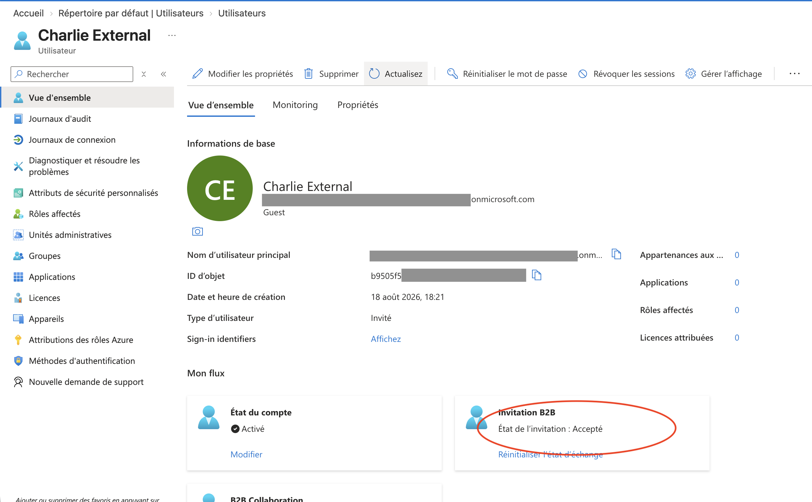

# Lab 2. B2B et administrative units

## Ce que le lab établit

Qu'une identité externe existe indépendamment de tout accès, et qu'une administrative unit délimite un périmètre d'administration sans propager l'appartenance aux membres des groupes qu'elle contient.

## Prérequis

| Élément | Valeur |
|---|---|
| Rôle Entra | Guest Inviter ou User Administrator pour l'invitation, Privileged Role Administrator pour créer une AU et y affecter un rôle |
| Licence | Aucune pour l'invitation B2B et pour une AU à membres assignés. P1 serait requis pour une AU à membres dynamiques et pour chaque administrateur affecté à un rôle à portée d'AU |

## Manipulations, partie B2B

Invitation d'un utilisateur externe depuis Users puis Invite external user, avec une adresse de messagerie extérieure au tenant.

Observation de l'objet créé avant acceptation, puis après acceptation du lien reçu par courriel.

Ajout de l'invité au groupe de sécurité du [lab 1](01-tenant-users-groups-rbac.md), qui porte le rôle Azure Reader sur un resource group.

Vérification de l'accès Azure obtenu par l'invité.

## Observations, partie B2B

Dès l'invitation et avant toute acceptation, l'objet utilisateur existe dans l'annuaire. Il porte `UserType` à `Guest` et `externalUserState` à `PendingAcceptance`. Il est déjà ciblable par un groupe et par une affectation.

Après acceptation, `externalUserState` passe à `Accepted`. `UserType` reste à `Guest`. Aucun passage automatique vers `Member` ne se produit : c'est une opération distincte, à effectuer manuellement si elle est souhaitée.

Les quatre compteurs à droite valent zéro. L'identité existe, l'accès n'existe pas : c'est exactement la séparation que le lab cherche à établir.

Une fois ajouté au groupe, l'invité obtient l'accès Azure Reader exactement comme un membre interne. Azure RBAC ne fait aucune différence selon le `UserType` du principal.

En parcourant l'annuaire, l'invité se heurte aux restrictions de lecture appliquées par défaut aux invités, réglées dans External Identities puis External collaboration settings.

## Manipulations, partie administrative unit

Création d'une administrative unit à membres assignés.

Ajout direct d'un utilisateur comme membre de l'AU.

Ajout d'un groupe comme objet de l'AU.

Examen de ce que couvre effectivement le périmètre.

## Observations, partie administrative unit

L'utilisateur ajouté directement apparaît dans l'onglet Users de l'AU.

Le groupe ajouté apparaît dans l'onglet Groups. Ses membres n'apparaissent nulle part dans l'AU. Un administrateur portant un rôle à portée de cette AU peut donc gérer le groupe lui-même, notamment sa composition, mais ne peut pas réinitialiser le mot de passe d'un de ses membres ni modifier son compte, sauf si ce membre a été ajouté individuellement à l'AU.

## Ce qu'il faut en retenir

L'identité et l'entitlement sont deux choses. Un invité peut exister dans l'annuaire pendant des mois sans détenir le moindre accès, et c'est le cas normal. Inversement, l'accès disparaît en le retirant du groupe, sans toucher à l'identité.

L'acceptation d'une invitation change un état de rachat, pas une nature. Confondre `externalUserState` et `UserType` est une erreur fréquente.

La non-transitivité d'une AU est documentée et volontaire. Pour donner à un administrateur régional la main sur les comptes de sa région, il faut que ces comptes soient membres de l'AU, ce qui plaide en pratique pour une AU à membres dynamiques, donc pour une licence P1.

Il faut noter que le mécanisme inverse existe : une restricted management AU protège ses objets contre les administrateurs à portée tenant, ce qui n'était pas démontrable ici mais répond au besoin symétrique d'isoler des comptes sensibles.

## Lien avec l'examen

Domaine « Implement and manage user identities », sous-sections identités externes et administrative units. Voir la fiche [01](../fiches/01-identites-utilisateurs.md).
