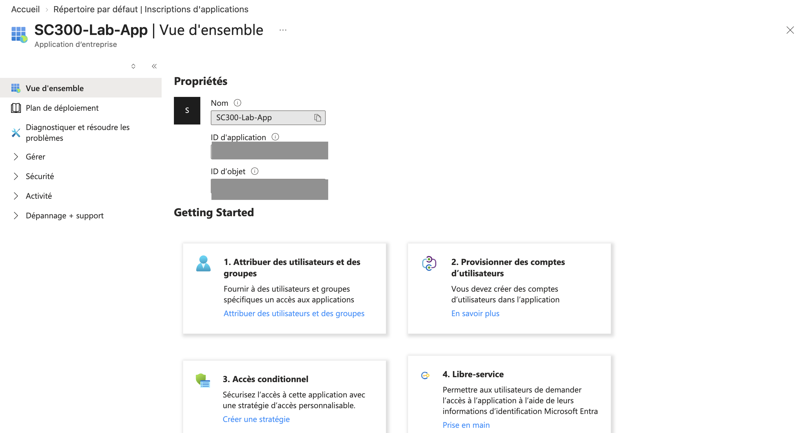
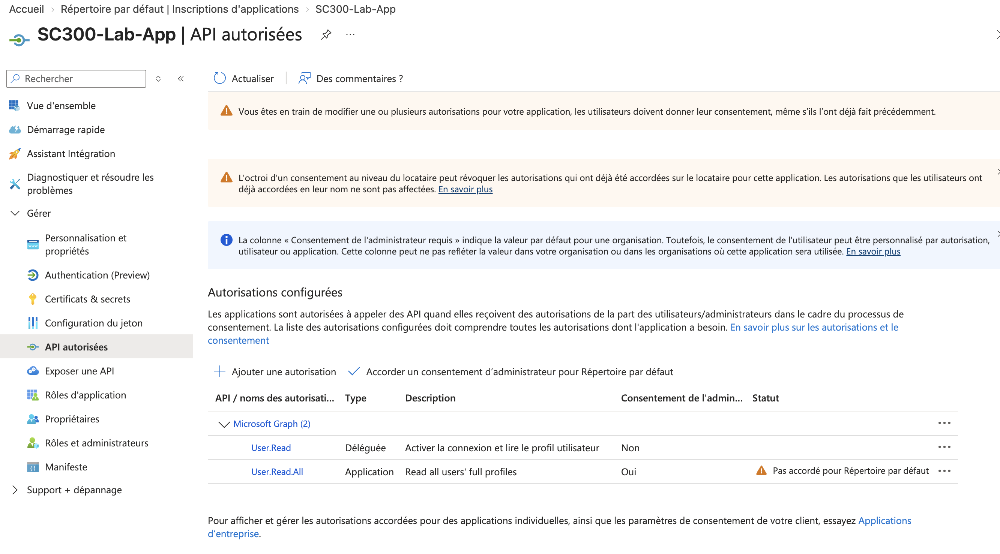
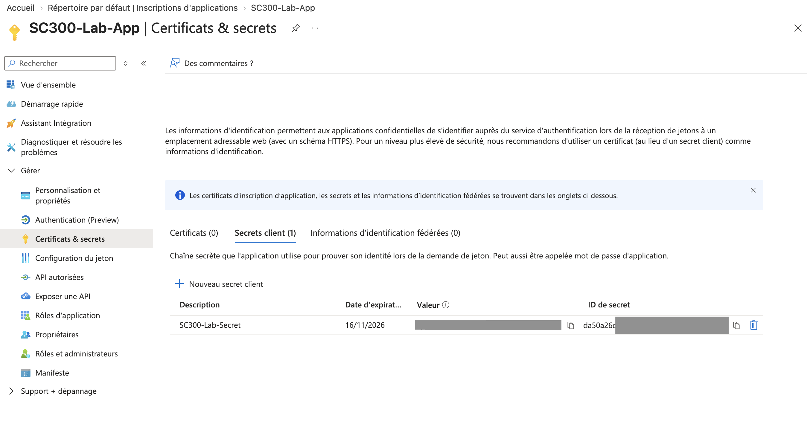
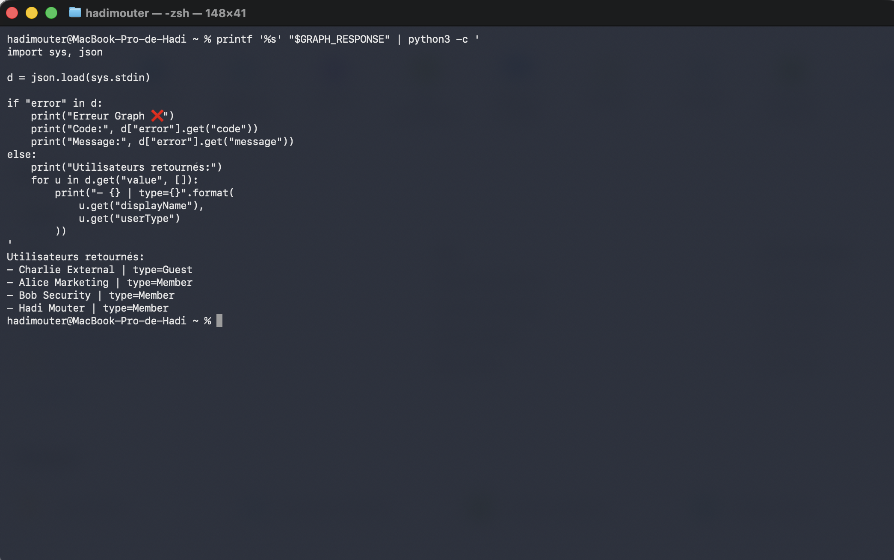

# Lab 3. App registration, service principal et Microsoft Graph

## Ce que le lab établit

Qu'enregistrer une application crée deux objets distincts, que le consentement est une opération séparée de la configuration d'une permission, et que le contenu d'un access token app-only reflète exactement ce qui a été consenti.

## Prérequis

| Élément | Valeur |
|---|---|
| Rôle pour enregistrer l'application | Aucun rôle particulier si le tenant autorise les utilisateurs à enregistrer des applications, sinon Application Developer |
| Rôle pour consentir à un app role Microsoft Graph | **Privileged Role Administrator** ou Global Administrator. Application Administrator et Cloud Application Administrator ne suffisent pas pour cette famille de permissions |
| Licence | Aucune |

Le prérequis de rôle est le point le plus intéressant du lab. Les deux rôles dédiés à l'administration des applications peuvent consentir à n'importe quelle permission de n'importe quelle API, à une exception près : les app roles Microsoft Graph, qui donnent un accès non filtré à l'annuaire.

## Manipulations

Création d'une app registration mono-tenant.

Comparaison des deux vues. Ouverture de l'objet sous App registrations, puis du service principal correspondant sous Enterprise applications, en relevant les identifiants de chacun.

Ajout d'une permission déléguée `User.Read` sur Microsoft Graph.

Ajout d'une permission applicative `User.Read.All` sur Microsoft Graph.

Consentement administrateur sur les deux.

Création d'un client secret, avec une durée volontairement courte.

Exécution d'un client credentials flow et récupération d'un access token.

Appel de `GET https://graph.microsoft.com/v1.0/users` avec ce token.

Décodage du token et examen des claims.

Suppression du client secret en fin de lab.

## Observations

L'application object et le service principal portent le **même Application (client) ID** et des **Object ID différents**. C'est la vérification la plus rapide pour établir qu'il s'agit de deux objets et non de deux vues du même.



Le sous-titre indique « Application d'entreprise » là où l'écran App registrations indique « Inscription d'application » : ce sont bien deux objets. Les deux identifiants sont masqués sur la capture, la comparaison a été faite en direct.

Avant consentement, la colonne Status de l'écran API permissions affiche un avertissement sur les deux permissions, et l'appel Graph échoue. Après consentement, la colonne passe à un statut accordé pour le tenant. Configurer et accorder sont bien deux opérations distinctes.



Cette capture porte trois enseignements en une seule vue. Les deux permissions viennent de la même API et portent presque le même nom, mais l'une est Déléguée et l'autre Application. La colonne « Consentement de l'administrateur requis » vaut Non pour la première et Oui pour la seconde. Et le statut d'avertissement montre qu'une permission configurée n'est pas une permission accordée.

Le corps de la requête de token confirme que le scope doit valoir `https://graph.microsoft.com/.default`. Une tentative avec `https://graph.microsoft.com/User.Read.All` est rejetée : dans le client credentials flow, `.default` n'est pas une commodité mais la seule valeur acceptée.

```
POST https://login.microsoftonline.com/{tenantId}/oauth2/v2.0/token

client_id={clientId}
&scope=https://graph.microsoft.com/.default
&client_secret={secret}
&grant_type=client_credentials
```

Le token décodé contient :

| Claim | Valeur observée | Lecture |
|---|---|---|
| `roles` | `["User.Read.All"]` | La permission applicative consentie |
| `scp` | absent | Aucune permission déléguée, il n'y a pas d'utilisateur |
| `idtyp` | `app` | Marqueur d'un token app-only |
| `aud` | l'URI de Microsoft Graph | Ressource cible |
| `appid` | le Client ID de l'application | L'application émettrice |
| `sub` | l'Object ID du service principal | Le sujet est l'application, pas un utilisateur |

La permission déléguée `User.Read` n'apparaît nulle part dans ce token, ce qui est attendu : elle n'a de sens que dans un flux avec utilisateur.

Le secret utilisé pour ce flux n'expose jamais sa valeur dans le portail après création :



![Décodage du token app-only : aud graph.microsoft.com, roles ['User.Read.All'], scp None, tid et azp masqués](../screenshots/lab3-claims-token-app-only.png)

Les secrets sont passés par variables d'environnement (`$CLIENT_SECRET`, `$TENANT_ID`) et n'apparaissent à aucun moment en clair.

L'appel `GET /v1.0/users` renvoie l'ensemble des utilisateurs du tenant, sans filtrage. C'est la démonstration concrète de l'écart entre les deux modèles : la même permission en délégué aurait été bornée par les droits de l'utilisateur connecté.



L'appel remonte y compris l'invité, sans qu'aucun utilisateur ne soit connecté.

## Ce qu'il faut en retenir

Le nom d'une permission ne suffit jamais à la caractériser. `User.Read.All` existe en délégué et en applicatif, et les deux ne donnent pas du tout la même chose.

Le contenu d'un token app-only dépend de ce qui a été consenti, pas de ce que le code demande. Ce qui se lit dans `roles` est le résultat des app role assignments portés par le service principal.

`idtyp` valant `app` est le seul marqueur fiable d'un token app-only. La présence de `roles` ne prouve rien, puisqu'un token utilisateur peut lui aussi en contenir, pour y porter les app roles métier de cet utilisateur.

Le secret est le maillon faible de la chaîne. Il a une valeur affichable une seule fois, une date d'expiration à surveiller, et il se copie. Un certificat, et mieux encore une managed identity ou une workload identity federation, suppriment ce problème. Le secret a été supprimé en fin de lab plutôt que laissé à expirer.

## Lien avec l'examen

Domaine « Plan and implement workload identities ». Voir la fiche [03](../fiches/03-identites-workload.md).
