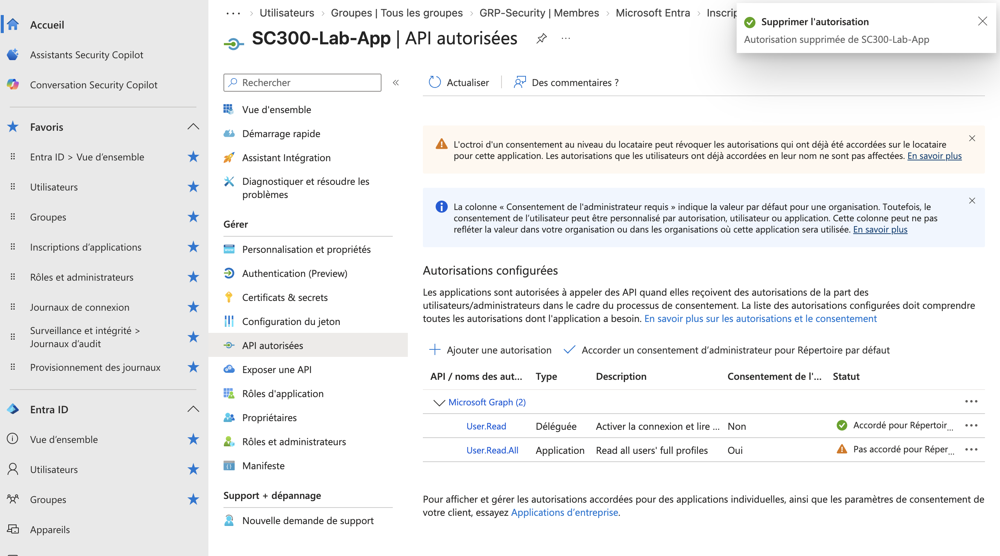

# Lab 5. Retrait d'accès et moindre privilège

## Ce que le lab établit

Que retirer un accès demande de distinguer l'identité, l'appartenance et le consentement, et que révoquer un consentement ne coupe pas une session déjà en cours.

## Situation de départ

À l'issue des labs précédents, le tenant présente quatre situations à traiter, chacune correspondant à un mécanisme de retrait différent.

Un utilisateur interne détient Reader sur un resource group via son appartenance à un groupe de sécurité. Cet accès est légitime et doit être préservé.

Un invité détient le même accès Azure par le même groupe. Cet accès n'est plus justifié.

Un propriétaire de groupe, qui n'en est pas membre, doit continuer à gérer le groupe sans recevoir ce que le groupe distribue.

Une application détient la permission applicative `User.Read.All` sur Microsoft Graph, consentie au niveau du tenant. Cette permission est trop large pour son besoin réel.

## Prérequis

| Élément | Valeur |
|---|---|
| Rôle pour modifier l'appartenance du groupe | Propriétaire du groupe, ou Groups Administrator |
| Rôle pour révoquer un consentement Graph applicatif | Privileged Role Administrator ou Global Administrator |
| Licence | Aucune |

## Actions et observations

### Retirer l'invité du groupe

Le retrait est immédiat côté annuaire. Côté Azure, la vérification par Check access ne reflète pas le changement instantanément : le cache d'Azure Resource Manager peut retarder la prise en compte de plusieurs minutes. Un test effectué trop tôt donne un faux négatif et pousse à chercher un problème qui n'existe pas.

Après propagation, l'invité n'a plus aucun rôle Azure effectif. Son compte, lui, existe toujours dans l'annuaire : l'identité survit à l'entitlement, ce qui est cohérent mais laisse un compte invité orphelin. Dans un tenant disposant d'Entitlement Management, la policy d'un access package aurait pu supprimer automatiquement le compte à l'expiration de la dernière assignment. En édition Free, ce nettoyage reste manuel.

### Vérifier le membre interne

L'utilisateur interne conserve Reader. Le retrait a bien porté sur une appartenance individuelle et non sur l'affectation de rôle, qui vise toujours le groupe.

### Vérifier le propriétaire

Le propriétaire n'a reçu aucun accès Azure à aucun moment du lab. Il continue de gérer la composition du groupe.

C'est ici que le raisonnement de moindre privilège doit aller plus loin que le constat. Le propriétaire dispose d'un chemin d'escalade direct : il peut s'ajouter lui-même comme membre et obtenir Reader, sans approbation ni trace autre qu'une entrée dans les Audit logs. Le cloisonnement Owner et Member documente une séparation de responsabilités, il ne constitue pas une barrière technique. Gouverner la propriété d'un groupe est donc aussi important que gouverner son appartenance, et c'est exactement ce que PIM for Groups permettrait de rendre temporaire dans un tenant en P2.

### Révoquer le consentement administrateur

La révocation s'effectue depuis Enterprise applications, sur le service principal, onglet Permissions. Elle supprime l'app role assignment.

Un test immédiat montre que l'access token obtenu avant la révocation **continue de fonctionner** contre Microsoft Graph. C'est l'observation la plus utile du lab : un access token est autoporteur, il embarque ses autorisations au moment de son émission, et rien ne le rappelle. Il reste valide jusqu'à son expiration, soit environ une heure.

Pour couper immédiatement, il faut agir sur l'identité et non sur la permission : désactiver le service principal, ou supprimer le credential. C'est aussi la raison d'être de la continuous access evaluation, qui n'est pas disponible pour ce scénario en édition Free.

### Supprimer la permission configurée

La suppression de `User.Read.All` de l'écran API permissions est une opération distincte de la révocation du consentement. Après elle, l'application ne demande plus la permission, ce qui empêche un futur consentement de la réaccorder par inadvertance.

Les deux permissions se lisent côte à côte : la déléguée conserve son consentement, l'applicative l'a perdu.

L'ordre importe. Révoquer sans supprimer laisse la permission configurée, donc reconsentable en un clic. Supprimer sans révoquer laisse le grant en place sur le service principal.

### Vérifier les traces

Les Audit logs portent chacune de ces opérations, avec l'acteur dans Initiated by : le retrait du membre du groupe, la révocation de l'app role assignment, et la suppression de la permission configurée.

## Ce qu'il faut en retenir

Retirer un accès demande d'identifier par quel mécanisme il a été accordé. Une appartenance de groupe se retire du groupe, un consentement se révoque sur le service principal, une permission configurée se supprime de l'app registration, et une identité se désactive ou se supprime.

Révoquer un consentement retire le droit d'obtenir un nouveau token, pas la validité des tokens déjà émis.

Le moindre privilège consiste à retirer ce qui n'est plus nécessaire, pas tout ce qui est retirable. Le membre interne a conservé son accès parce qu'il était justifié ; l'exercice aurait été raté si le groupe ou l'affectation de rôle avaient été supprimés.

Ce que ce lab montre en creux est la valeur de la gouvernance. Chacune de ces quatre opérations a été décidée à la main, justifiée à la main, et rien ne garantit qu'elle sera refaite dans six mois. C'est précisément ce que les access reviews et les access packages automatisent, et ce que l'édition Free ne permet pas de démontrer.

## Lien avec l'examen

Domaines « Plan and implement workload identities » et « Plan and automate identity governance ». Voir les fiches [03](../fiches/03-identites-workload.md) et [04](../fiches/04-gouvernance-identites.md).
